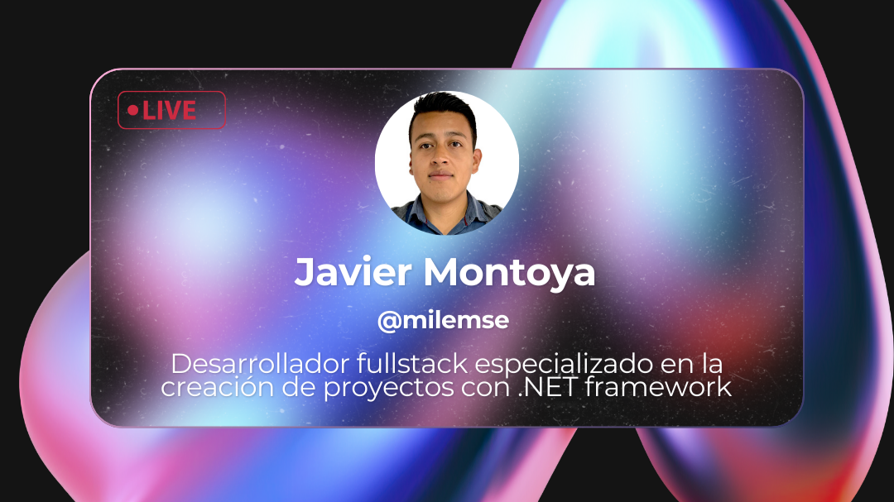

# ¡Bienvenidos a mi perfil!
Soy Javier Montoya, fullstack developer 💻. Enfocado en siempre hacer que los proyectos funcionen de la manera más optima 📈 y buscando la menara de innovar con la creación ⚙️ y el mejoramiento de nueva funcionalidad.

## Tecnologias 💻

## Las estadisticas del repositorio

